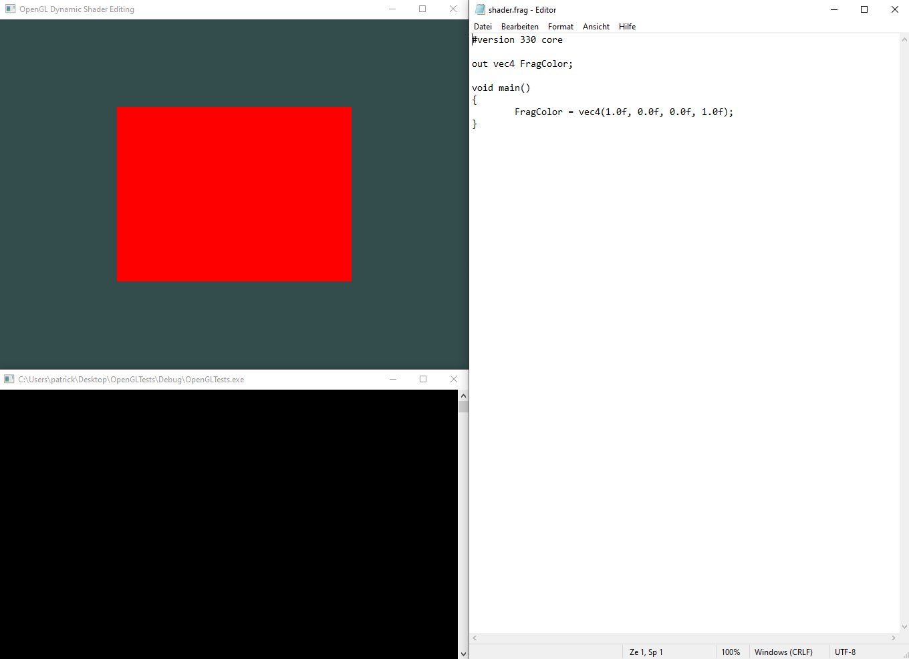
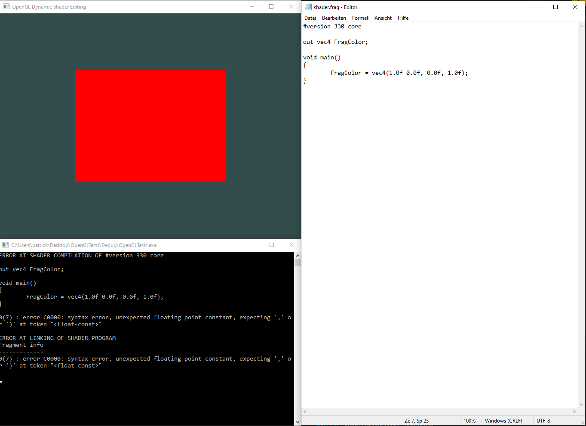
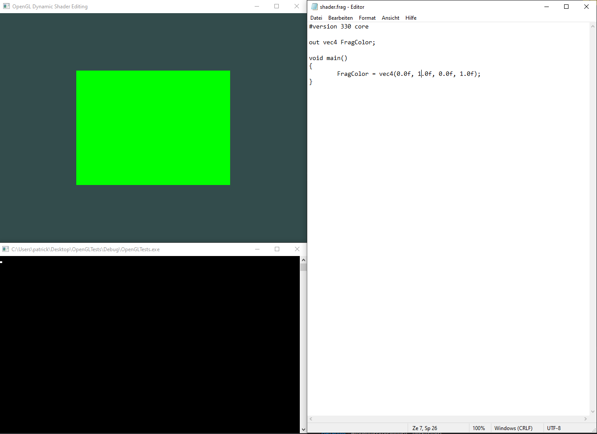

# opengl-dynamic-shader-editing
This **Shader Program Wrapper** enables the user to dynamically **edit shaders
at runtime**. It can be either used for debugging shaders or while presenting 
the effects of changes to the shader code.

## Note

Tested with _GLFW_ and _GLAD_. Header file might have to be modified to fit your project.

## How to use

1. Initialize the Shader Program Wrapper with a Vertex Shader and a Fragment Shader:
```c++
ShaderProgramWrapper spw("shaders/vertex_shader.shader", 
  "shaders/fragment_shader.shader", 
  true);
```

If the last parameter is set to **false**, the shader files will not be watched.

2. Use the underlying Shader Program to render:
```c++
spw.UseShaderProgram();
```

3. You can edit the shader files **at runtime** and 
changes will apply after saving.

## Impressions

Window, console and fragment shader which is ready to be edited:


Saving **with errors** in the shader does show them in the console:


Saving **without errors** in the shader yields the expected results:


